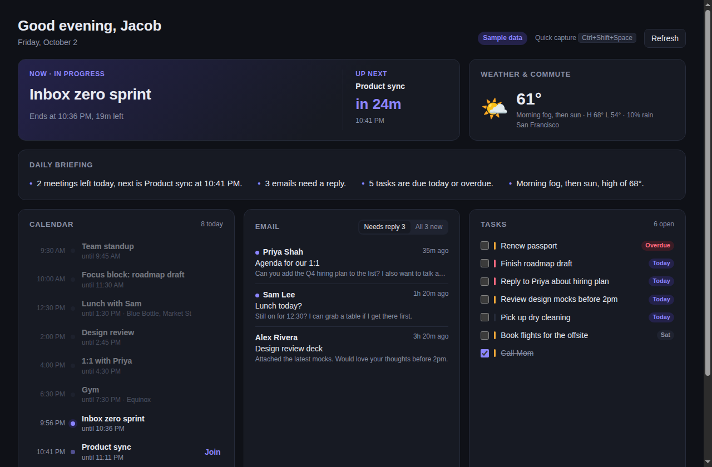

# Hub

A personal life dashboard for Mac and Windows, with a dark theme. One page that pulls your calendar, email, tasks and weather together, with a menu bar / tray countdown to your next meeting and a global shortcut for capturing tasks and notes from anywhere.



> **Status:** connects to Google Calendar and Gmail, real weather and commute times, and has its own task list. Claude writes a daily briefing, picks out the emails that need a reply and drafts replies for you, and the evening wrap-up rolls unfinished items into tomorrow. Anything you haven't connected yet shows sample data. Next up: the automatic morning routine.

## Download Hub

Download the newest installer from the [Releases page](https://github.com/jhscherwitz/hub-app/releases): `Hub-Setup-….exe` for Windows, `Hub-…-mac.dmg` for Mac. Hub updates itself after that: when a new version is out it downloads in the background and asks you to restart.

Hub isn't code-signed yet, so the first time you open it:

- **Windows** shows **Windows protected your PC**. Click **More info**, then **Run anyway**.
- **Mac:** open the `.dmg` and drag **Hub** into **Applications**. Open Hub; when macOS says it can't check it for malicious software, click **Done**, open **System Settings → Privacy & Security**, scroll down and click **Open Anyway** next to Hub.

## Run it from the code

You only need to do steps 1 and 2 once.

**1. Install Node.js.** Go to [nodejs.org](https://nodejs.org), download the version marked **LTS**, and run the installer. Click through with the default options.

**2. Download Hub.** Open a terminal:

- **Mac:** press ⌘ Space, type `Terminal`, and press Enter.
- **Windows:** press the Windows key, type `PowerShell`, and press Enter.

Then copy and paste these lines one at a time, pressing Enter after each:

```bash
git clone https://github.com/jhscherwitz/hub-app.git
cd hub-app
npm install
```

The last one takes a minute or two. If your computer says `git` isn't installed, a Mac will offer to install it for you (click **Install**); on Windows, install it from [git-scm.com](https://git-scm.com) and open a new PowerShell window.

**3. Start Hub.** In the same terminal, type:

```bash
npm run dev
```

The dashboard opens in its own window. Leave the terminal open while you use it.

**Next time**, open a terminal and run:

```bash
cd hub-app
npm run dev
```

**To stop Hub**, click its icon in the menu bar (Mac) or system tray (Windows) and choose **Quit Hub**, or press Ctrl+C in the terminal.

**To get the latest version** after changes are made, run `git pull` and then `npm install` inside the `hub-app` folder before `npm run dev`.

## Connect your accounts

Everything is set up from **Settings** (top right of the dashboard). Until a section is connected, it shows sample data, and the header shows a **Some sample data** badge.

### Google Calendar and Gmail

Hub signs in to Google itself, so Google needs to know about it first. You do this once, in Google Cloud, and it's free. It takes about 10 minutes. Use the same Google account your calendar and Gmail are on.

**A. Make a project**

1. Go to [console.cloud.google.com](https://console.cloud.google.com) and sign in. If it asks you to agree to the terms, tick the box and click **Agree and continue**.
2. At the top left, click the project picker (it says **Select a project**), then **New project**.
3. For **Project name**, type `Hub`. Click **Create**.
4. When it's done, click the project picker again and choose **Hub**, so it's the selected project for the next steps.

**B. Turn on the Calendar and Gmail APIs**

5. Open the [Google Calendar API page](https://console.cloud.google.com/apis/library/calendar-json.googleapis.com) and click **Enable**.
6. Open the [Gmail API page](https://console.cloud.google.com/apis/library/gmail.googleapis.com) and click **Enable**.

**C. Set up the sign-in screen**

7. Open [Google Auth Platform](https://console.cloud.google.com/auth/overview) and click **Get started**.
8. **App name:** `Hub`. **User support email:** pick your email. Click **Next**.
9. **Audience:** choose **External**. Click **Next**.
10. **Contact information:** type your email. Click **Next**.
11. Tick the box to agree, then click **Continue** and **Create**.
12. In the left menu, click **Audience**. Under **Test users**, click **Add users**, type your Gmail address, and click **Save**.
13. Still on **Audience**, click **Publish app**, then **Confirm**. This keeps you signed in. If you skip it, Google signs Hub out once a week and you'll need to click **Sign in with Google** again. If Google asks about verification, you don't need it: Hub is only for you.

**D. Create Hub's key**

14. In the left menu, click **Clients**, then **Create client**.
15. **Application type:** choose **Desktop app**. **Name:** `Hub`. Click **Create**.
16. A box shows your **Client ID** and **Client secret**. Keep this box open. Google only shows the secret once (if you lose it, open the client and click **Add secret**).

**E. Sign in from Hub**

17. In Hub, click **Settings**. Paste the **Client ID** and **Client secret** into the boxes and click **Save**.
18. Click **Sign in with Google**. Your web browser opens.
19. Choose your Google account. Google will say **Google hasn't verified this app**. That's expected, because it's your own app: click **Advanced**, then **Go to Hub (unsafe)**.
20. Tick **every** box (see your calendar, read your email, and manage drafts), then click **Continue**.
21. The browser says **You're signed in**. Close the tab and go back to Hub. Your real calendar and inbox appear within a few seconds.

Hub reads your calendar and email, and saves draft replies in Gmail when you click **Draft reply**. Google's wording for the draft permission is "manage drafts and send emails", but Hub never sends anything: drafts wait in your Gmail **Drafts** folder until you send them yourself. Your sign-in is stored encrypted on your computer and never leaves it. To disconnect, click **Sign out** in Settings.

**Signed in before draft replies were added?** Hub needs the new draft permission once. In **Settings**, click **Sign out**, then **Sign in with Google**, and tick every box. Until then the dashboard shows a reminder.

### Claude (AI writing)

Claude writes your daily briefing, decides which emails need a reply, drafts replies, and sums up your evening wrap-up. It's optional: without it, Hub writes simpler versions itself and everything still works.

Claude needs an Anthropic API key. You pay Anthropic for what Hub uses, which for one person is a few cents a day (a rough estimate; your Anthropic account shows the real figure).

1. Go to [console.anthropic.com](https://console.anthropic.com) and sign up (or sign in).
2. In the left menu, click **Billing** and add some credit. $5 is plenty to start.
3. In the left menu, click **API keys**, then **Create key**. Name it `Hub` and click **Create**.
4. Click **Copy**. Anthropic only shows the key once.
5. In Hub, open **Settings**. Under **Claude (AI writing)**, paste the key and click **Save**. Hub checks the key with Anthropic first, then stores it encrypted on your computer.

To make this work, Hub sends your calendar, task titles and the emails it's working on to Anthropic. To turn Claude off, click **Remove key** in Settings.

### Weather

In **Settings → Weather**, type your town, click **Search**, and click the right result. Weather comes from [Open-Meteo](https://open-meteo.com), which is free and needs no account.

### Commute

In **Settings → Commute**, type your home address, choose **Drive**, **Bike** or **Walk**, and click **Save**. When your next event today has an address, the Weather & commute card shows how long it takes to get there and when to leave. Travel times come from OpenStreetMap and don't include live traffic, so Hub adds 10 minutes. Events whose location is a room name or a video link are skipped.

### Tasks

Hub has its own task list. Add tasks from the box at the top of the Tasks card, or from anywhere with quick capture. Tick a task to complete it; hover over it and click **×** to delete it.

<details>
<summary>More commands (for later)</summary>

| Command | What it does |
| --- | --- |
| `npm start` | Builds everything and runs the finished version. |
| `npm run typecheck` | Checks the code for type errors. |
| `npm test` | Runs the automated tests. |
| `npm run package:mac` | Builds a Mac app (`.dmg`) into `release/`. Run it on a Mac. |
| `npm run package:win` | Builds a Windows installer into `release/`. Run it on Windows. |

The built apps aren't signed yet, so the first time you open one, macOS will ask you to right-click → **Open**, and Windows will ask you to click **More info → Run anyway**.

</details>

<details>
<summary>Publishing a new version (for Jacob)</summary>

GitHub builds the Windows and Mac installers for you. In PowerShell, inside the `hub-app` folder, on the `main` branch:

1. `git pull`
2. `npm.cmd version patch` (this bumps 0.1.0 to 0.1.1; use `minor` for 0.2.0). It saves the new number and makes a version tag.
3. `git push --follow-tags`
4. Open the repo's **Actions** tab and wait for **Build installers** to go green.
5. Open **Releases**. There's a **Draft** with both installers attached. Click the pencil, write a line about what changed, and click **Publish release**. Installed copies of Hub pick it up within a few hours.

Code signing turns on by itself once the signing secrets are added to the repo (Settings → Secrets and variables → Actions): `MAC_CERTIFICATE`, `MAC_CERTIFICATE_PASSWORD`, `APPLE_ID`, `APPLE_APP_SPECIFIC_PASSWORD` and `APPLE_TEAM_ID` for Mac, and `AZURE_TENANT_ID`, `AZURE_CLIENT_ID` and `AZURE_CLIENT_SECRET` (plus the variables `AZURE_SIGNING_ENDPOINT`, `AZURE_SIGNING_ACCOUNT`, `AZURE_CERT_PROFILE` and `AZURE_PUBLISHER_NAME`) for Windows. Without them, builds still work, unsigned.

</details>

## Using it

- **Daily briefing.** At the top: a one-line summary of the day and a few points on what matters (when to leave, who's waiting on a reply, which task to start with, anything carried over from last night). With Claude, it's written once each morning; click **Rewrite** for a fresh one. Without Claude, Hub's quick summary shows instead.
- **Now.** The meeting you're in (with a **Join call** button), when to leave for your next in-person event, a call that starts in the next 10 minutes, or otherwise your top task (overdue first, then due today) with how long you're free. Click **Mark done** to tick it off.
- **Needs a reply.** Only the emails that need an answer from you: from a person, in your Primary inbox, and not already replied to. With Claude, it reads each one and decides, with a short reason; without it, Hub shows the unread ones. Click **Draft reply** and the reply is saved in Gmail's **Drafts**, threaded under the original. Hub never sends it: open Gmail, check it, and send it yourself. Click an email to open it in Gmail.
- **Evening wrap-up.** Click **Wrap up the day** (it lights up after 5 PM). Hub lists what you finished and what's still open. Untick anything you want to drop, add a note for tomorrow, and click **Finish the day**. Ticked tasks move to tomorrow, and everything you kept shows up in tomorrow morning's briefing.
- **Menu bar / tray.** On macOS the next meeting and a live countdown sit in the menu bar ("Product sync in 25m"). On Windows the countdown is in the tray icon's tooltip and menu; click the icon to open the dashboard. Closing the window keeps Hub running there; use **Quit Hub** from the menu to exit.
- **Quick capture.** Press **⌘⇧Space** (Mac) or **Ctrl+Shift+Space** (Windows) anywhere. Type, then **Enter** to save. **Tab** switches between task and note, **Esc** closes. If another app already owns that shortcut, Hub falls back to **⌘⌥Space** / **Ctrl+Alt+Space**; the dashboard header shows which one is active.

Tasks, notes, wrap-ups and settings are saved in Hub's app data folder, so they survive restarts.

## How it's built

[Electron](https://www.electronjs.org) + [React](https://react.dev) + TypeScript, bundled with [Vite](https://vite.dev).

```
electron/
  main.ts          windows, global shortcut, IPC, refresh timer
  tray.ts          menu bar / tray icon and countdown
  preload.ts       the safe `window.hub` API the UI talks to
  hub.ts           pulls every source into one DashboardSnapshot
  notes.ts         local store for captured notes
  settings.ts      settings file; secrets encrypted with the OS keychain
  updater.ts       auto-update from GitHub Releases (installed copies only)
  http.ts          fetch helper (timeouts, readable errors)
  google/
    auth.ts        Google sign-in (OAuth + PKCE via the browser), token refresh
    calendar.ts    Google Calendar source
    gmail.ts       Gmail source: inbox, reading a message, saving drafts
  smart/
    index.ts       SmartLayer: briefing, triage, drafts and wrap-up, with or without Claude
    claude.ts      Claude API client (key from Settings)
    briefing.ts    the daily briefing (Claude's and Hub's basic one)
    triage.ts      which emails need a reply
    drafts.ts      draft replies
    wrapup.ts      the evening wrap-up and what carries over
  sources/
    types.ts       the data-source interfaces
    sample.ts      sample implementations (used until something is connected)
    weather.ts     Open-Meteo weather and place search
    commute.ts     OpenStreetMap travel times
    tasks.ts       Hub's own task list
    index.ts       createSources(): picks which implementation backs each source
src/
  shared/          types, time helpers and the Now card's logic, used by both sides
  renderer/        the React dashboard, Settings and the quick-capture window
test/              automated tests (npm test)
assets/            tray and app icons
```

### Adding a real data source

All data flows through five interfaces in `electron/sources/types.ts`: `CalendarSource`, `EmailSource`, `TaskSource`, `WeatherSource` and `CommuteSource`. To connect another service, implement the matching interface, then return it from `createSources()` in `electron/sources/index.ts`. That function runs again whenever settings change, so it can choose between the real source and the sample one. The UI, tray and briefing don't change.

Sources run in the Electron main process, so API keys and OAuth tokens never reach the web page. If one source throws, its section comes back empty, the dashboard shows which source failed, and everything else still loads.
